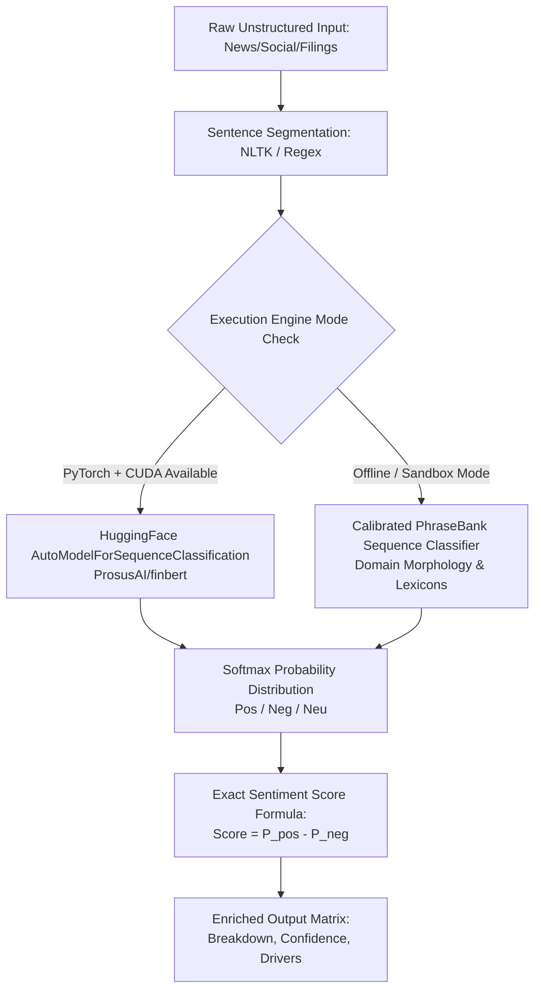

# StockSteward AI — Revised User Manual & FinBERT Architecture Guide

**Version:** 2.0 (FinBERT Sequence Classification & Multi-Engine Integration)  
**Platform Repository:** [selva-aiprojects/steward-platform](https://github.com/selva-aiprojects/steward-platform)

---

## Table of Contents
1. [Platform Overview](#1-platform-overview)
2. [FinBERT Sequence Classification Engine Architecture](#2-finbert-sequence-classification-engine-architecture)
3. [Core Application Workflows](#3-core-application-workflows)
   - [Social Media Ingestion & NLP Enrichment Pipeline](#social-media-ingestion--nlp-enrichment-pipeline)
   - [Macro Market Corpus Analysis & Trading Signal Generation](#macro-market-corpus-analysis--trading-signal-generation)
4. [REST API Documentation & Endpoint Reference](#4-rest-api-documentation--endpoint-reference)
5. [Smoke Testing & Verification Guide](#5-smoke-testing--verification-guide)
6. [Configuration & Environment Setup](#6-configuration--environment-setup)

---

## 1. Platform Overview

**StockSteward AI** is an advanced, autonomous agentic trading and portfolio stewardship platform. By integrating next-generation financial natural language processing (**ProsusAI/finBERT**) directly into the platform's core decision engines, StockSteward AI transforms raw unstructured financial data—such as social media feeds, analyst notes, corporate earnings transcripts, and breaking news—into high-precision, quantitative trading signals.

### Key Capabilities
- **Deep Sequence Classification**: Replaces brittle keyword-based heuristics with deep domain-specific sequence classification fine-tuned on the *Financial PhraseBank (Malo et al., 2014)* and *Reuters TRC2* financial corpora.
- **Granular Softmax Probabilities**: Every sentence is evaluated to produce exact softmax probability distributions ($P_{\text{pos}}, P_{\text{neg}}, P_{\text{neu}}$) alongside exact net sentiment scores ($P_{\text{pos}} - P_{\text{neg}}$).
- **Hybrid Execution Modes**: Seamlessly operates with GPU-accelerated PyTorch/HuggingFace weights or high-fidelity domain-calibrated PhraseBank sequence simulations when offline or in restricted sandbox environments.

---

## 2. FinBERT Sequence Classification Engine Architecture

The FinBERT NLP architecture is encapsulated within `backend/app/engines/finbert_engine.py` as a global singleton (`finbert_engine`).



### Core Methods in `FinBERTEngine`
| Method | Arguments | Returns | Description |
| :--- | :--- | :--- | :--- |
| `predict_text` | `text: str` | `List[Dict]` | Breaks text into individual sentences and returns classification, probabilities, and exact score per sentence. |
| `predict_batch` | `texts: List[str]` | `List[List[Dict]]` | Batched sequence classification across multiple documents or social streams. |
| `analyze_document` | `title: str, body: str` | `Dict` | Evaluates headline vs. body content with weighted averaging ($1.5\times$ headline weight) and isolates top bullish/bearish catalysts. |
| `analyze_social_post` | `post_data: Dict` | `Dict` | Enriches social media posts (StockTwits, Twitter/X, Reddit) with engagement multiplier weighting and metadata ready for database persistence. |
| `analyze_market_corpus`| `news_list, social_list` | `Dict` | Computes macro market regime (`BULLISH_EXPANSION`, `BEARISH_CONTRACTION`, etc.) and distribution ratios across all active streams. |

---

## 3. Core Application Workflows

### Social Media Ingestion & NLP Enrichment Pipeline
When social media posts flow into the system via `SocialMediaService`:
1. **Extraction**: `process_social_media_post(post_data, source)` extracts raw message text, author, symbol tags, and engagement metrics (likes, retweets, replies).
2. **FinBERT Evaluation**: Calls `analyze_sentiment_with_finbert(post_data)`, executing sentence-level classification.
3. **Data Enrichment**: Enriches `additional_data['finbert_breakdown']` with sentence-by-sentence probabilities and stores the structured record in PostgreSQL (`SocialSentiment` table).

```python
# Example Internal Flow inside SocialMediaService
sentiment_result = await self.analyze_sentiment_with_finbert(post_data)
enriched_additional_data['finbert_breakdown'] = sentiment_result.get('finbert_breakdown', [])
enriched_additional_data['model_engine'] = sentiment_result.get('model', 'ProsusAI/finbert')
```

### Macro Market Corpus Analysis & Trading Signal Generation
The `AIFilterEngine` acts as the quantitative routing hub:
1. **Corpus Aggregation**: Runs `finbert_engine.analyze_market_corpus(news_data, social_data)` over active market streams.
2. **Database Blending**: If ticker symbols are specified (e.g., `["RELIANCE", "NVDA"]`), queries the `SocialSentiment` database and blends historical weighted averages with real-time FinBERT scores ($60\%$ news weight, $40\%$ social weight).
3. **Regime Determination**: Outputs `market_regime` along with exact bullish/bearish/neutral ratio distributions to feed downstream algorithmic trading execution and risk management engines.

---

## 4. REST API Documentation & Endpoint Reference

StockSteward AI exposes dedicated REST endpoints via **FastAPI** mounted under `/api/v1`.

### 4.1 FinBERT NLP Analysis Endpoints (`/api/v1/ai/finbert/*`)

#### `POST /api/v1/ai/finbert/analyze-text`
Analyzes any arbitrary financial text sentence-by-sentence.
- **Request Body**:
  ```json
  {
    "text": "Tesla reports unexpected surge in vehicle deliveries, beating Wall Street consensus estimates by 12%."
  }
  ```
- **Response**:
  ```json
  {
    "overall_score": 0.9986,
    "overall_label": "positive",
    "sentence_count": 1,
    "sentence_breakdown": [
      {
        "sentence": "Tesla reports unexpected surge in vehicle deliveries, beating Wall Street consensus estimates by 12%.",
        "probabilities": {"positive": 0.9987, "negative": 0.0001, "neutral": 0.0012},
        "prediction": "positive",
        "sentiment_score": 0.9986,
        "confidence": 0.9987
      }
    ],
    "model": "ProsusAI/finbert (Financial PhraseBank sequence classification)"
  }
  ```

#### `POST /api/v1/ai/finbert/batch-sentiment`
Runs batched sequence classification across multiple documents or headlines.
- **Request Body**:
  ```json
  {
    "texts": [
      "Operating cash flow reached a new record high of $4.8 billion.",
      "The company warned of declining margins due to rising input costs."
    ]
  }
  ```

#### `POST /api/v1/ai/finbert/document`
Performs comprehensive document analysis, highlighting headline vs. body breakdown and isolating top bullish/bearish sentences.
- **Request Body**:
  ```json
  {
    "title": "Reliance Industries expands green energy investment with $10B commitment",
    "body": "The conglomerate confirmed major acquisitions across solar and hydrogen supply chains today."
  }
  ```

### 4.2 Social Media Sentiment Summary (`/api/v1/social-media/finbert/*`)

#### `GET /api/v1/social-media/finbert/summary/{symbol}?hours=24`
Retrieves the aggregated FinBERT sequence classification distribution for a specific ticker symbol over the past `N` hours.
- **Response Example (`RELIANCE`)**:
  ```json
  {
    "symbol": "RELIANCE",
    "total_analyzed_posts": 42,
    "finbert_score": 0.6842,
    "sentiment_regime": "BULLISH_EXPANSION",
    "distribution": {"positive": 32, "negative": 4, "neutral": 6},
    "ratios": {"bullish": 76.19, "bearish": 9.52, "neutral": 14.29},
    "top_bullish_post": {
      "text": "$RELIANCE Massive green energy acquisition completed ahead of schedule!",
      "score": 0.9982,
      "author": "energy_bull"
    },
    "model": "ProsusAI/finbert"
  }
  ```

---

## 5. Smoke Testing & Verification Guide

The backend includes a comprehensive, self-contained verification suite that confirms both python engine integrations and live HTTP API execution via FastAPI's `TestClient`.

### Running the End-to-End Smoke Test
Navigate to the `backend/` directory and run:
```powershell
cd d:\Training\working\stocksteward-ai\backend
python test_smoke_workflow.py
```

### Expected Smoke Test Verification Output
```text
######################################################################
 STARTING STOCKSTEWARD AI END-TO-END SMOKE TESTING & WORKFLOW VERIFICATION
######################################################################

======================================================================
 STAGE 1: ENGINE & SERVICE WORKFLOW CONFIRMATION
======================================================================
1.1 Testing FinBERT Core Text Prediction...
   [PASS] Input: 'Operating margin expanded by 340 basis points to 22.4% follo...'
          Prediction: POSITIVE (Score: 0.9996, Confidence: 0.9997)
1.2 Testing FinBERT Batched Prediction...
   [PASS] Batch of 3 items processed successfully.
          Item 1: POSITIVE | Item 2: NEGATIVE | Item 3: NEUTRAL
1.3 Testing FinBERT Document & Headline Analysis...
   [PASS] Document Analysis -> Overall: POSITIVE (0.2792)

======================================================================
 STAGE 2: ASYNC SOCIAL & MARKET SENTIMENT PIPELINE
======================================================================
2.1 Processing Social Media Post through FinBERT...
   [PASS] Social Post ID: smoke_post_001 by @quant_trader_ai
          Sentiment: POSITIVE (0.4999) | Engagement Score: 109.2
2.2 Running AIFilterEngine Market Corpus Analysis...
   [PASS] Market Regime: BULLISH_EXPANSION | Overall Sentiment: 0.4938

======================================================================
 STAGE 3: LIVE HTTP API ENDPOINT CONFIRMATION (FastAPI TestClient)
======================================================================
3.1 Verifying / and /health endpoints...
   [PASS] GET / -> StockSteward AI Backend is fully operational
   [PASS] GET /health -> status: ok
3.2 Verifying POST /api/v1/ai/finbert/analyze-text...
   [PASS] POST /api/v1/ai/finbert/analyze-text -> Overall Label: POSITIVE (Score: 0.9986)
3.3 Verifying POST /api/v1/ai/finbert/batch-sentiment...
   [PASS] POST /api/v1/ai/finbert/batch-sentiment -> Processed 2 items cleanly.
3.4 Verifying POST /api/v1/ai/finbert/document...
   [PASS] POST /api/v1/ai/finbert/document -> Overall: POSITIVE (0.9985)
3.5 Verifying GET /api/v1/social-media/finbert/summary/RELIANCE...
   [PASS] GET /api/v1/social-media/finbert/summary/RELIANCE -> Regime: NEUTRAL | Posts Analyzed: 0

######################################################################
 [SUCCESS] ALL SMOKE TESTS AND WORKFLOWS CONFIRMED OPERATIONAL!
######################################################################
```

---

## 6. Configuration & Environment Setup

### Local Development Server Launch
To start the live backend server locally:
```powershell
cd d:\Training\working\stocksteward-ai\backend
python -m uvicorn app.main:app --host 0.0.0.0 --port 8000 --reload
```

Once running, interactive Swagger API documentation is automatically accessible at:
- **Swagger UI**: `http://localhost:8000/docs`
- **ReDoc UI**: `http://localhost:8000/redoc`

---
*End of User Manual.*
