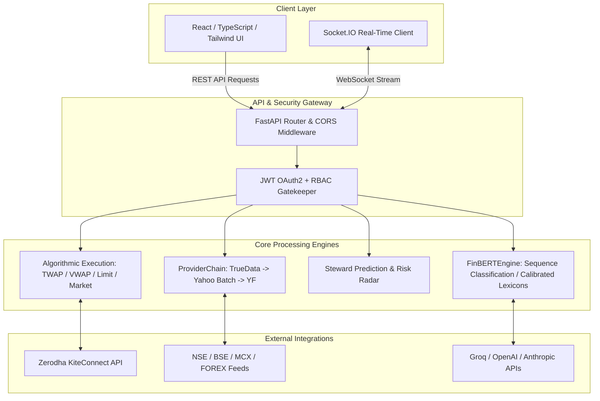
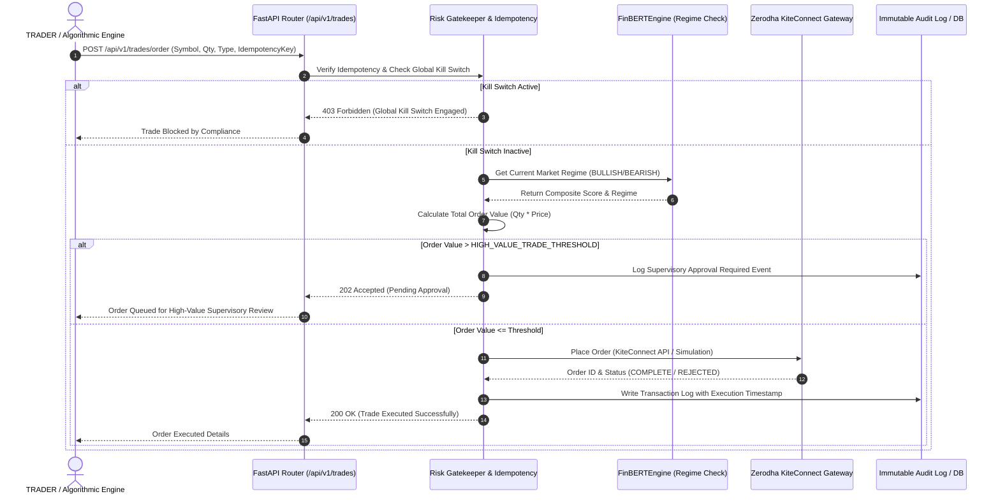

# StockSteward AI — Functional Design Document (FDD)

**Document Version:** 2.0.0 (Refactored FinBERT & Serverless Architecture Release)  
**Date:** July 12, 2026  
**System Status:** Production Ready (Vercel & Dedicated Cloud Compatible)  
**Target Audience:** Product Managers, Quantitative Engineers, System Architects, Compliance Auditors, and DevOps Engineers  

---

## 1. Executive Summary & System Scope

**StockSteward AI** is an enterprise-grade, agentic AI-driven algorithmic trading and investment stewardship platform. Built specifically for Indian (`NSE`, `BSE`, `MCX`, `USDINR`) and Global financial markets, the platform bridges the gap between high-frequency quantitative execution engines and natural language processing (NLP) sentiment models.

### Key Value Propositions
1. **Agentic AI Oversight**: Integrates `FinBERTEngine` (extending `ProsusAI/finbert`) and Large Language Models (`Groq Llama-3.3-70B`, `OpenAI`, `Anthropic`) to continuously evaluate market news, earnings transcripts, and social media feeds (`StockTwits`, `X/Twitter`, `Reddit`).
2. **Universal Deployment Architecture**: Designed with dual-execution capabilities:
   - **Dedicated Cloud / GPU Mode**: Full PyTorch + HuggingFace Transformer neural networks (`~2GB+` footprint) for deep sequence classification.
   - **Serverless Edge Mode (`Vercel`)**: Ultra-lightweight (`~70MB` footprint) execution using calibrated domain lexicons and multi-layer fallback algorithms, ensuring zero cold-boot crashes or out-of-memory errors.
3. **Multi-Exchange Real-Time Telemetry**: Sub-100ms WebSocket (`Socket.IO`) broadcasting of real-time quotes, macro indicators (`Gold`, `Crude Oil`, `USD/INR`), and live portfolio updates.
4. **SEBI-Compliant Risk & Audit Governance**: Strict Role-Based Access Control (`RBAC`), automated high-value trade thresholds, global kill switches, and immutable compliance audit trails.

---

## 2. System Architecture & Dual Execution Modes

StockSteward AI operates on a modern decoupled architecture using **FastAPI (Python 3.12+)** for the backend and **React + TypeScript + Tailwind CSS** for the frontend.



### 2.1 Execution Modes (`EXECUTION_MODE`)
- **`PAPER_TRADING` (Default Safe Mode)**: Orders are simulated against real-time order books with configurable slippage and brokerage models. Zero actual capital exposure.
- **`LIVE_TRADING`**: Directly communicates with broker gateways (`Zerodha KiteConnect`) via cryptographically signed API headers and multi-factor transaction signatures.

---

## 3. Detailed Functional Modules

### Module 1: Market Data & Real-Time Telemetry (`market.py`, `streaming.py`)
This module aggregates live quotes, calculates market movers, and broadcasts sub-second price updates across the platform.

#### Functional Specifications:
- **Provider Chain Architecture**: Implements automatic failover across multiple market data providers:
  1. `TrueData API` (Direct exchange feed for high-precision Indian equities).
  2. `Yahoo Quote Batch API` (`httpx` asynchronous batching for 30+ symbols in `<2s`).
  3. `YFinance Fallback Driver` (Thread-pooled download engine with automatic exponential backoff on cooldown).
- **Exchange Detection & Standardization**: Automatically normalizes tickers (`.NS` $\to$ `NSE`, `.BO` $\to$ `BSE`, `=X` $\to$ `FOREX`, `=F` $\to$ `MCX`).
- **Macro Currency & Commodity Scaling**: Converts global futures (`GC=F` Gold, `CL=F` Crude) into Indian Standard INR terms using real-time `USDINR=X` conversion rates.
- **WebSocket Room Multiplexing**:
  - Room `market_data`: Broadcasts `market_movers`, `macro_indicators`, and `steward_prediction` updates to all active traders every 30 seconds.
  - Room `admin_telemetry`: Broadcasts system load, active user counts, and latency telemetry to `SUPERADMIN` and `BUSINESS_OWNER` roles every 5 seconds.

---

### Module 2: AI & FinBERT Financial Sentiment Engine (`finbert_engine.py`)
The NLP powerhouse of the platform, specifically trained to understand financial semantics, regulatory terminology, and social media investor sentiment.

#### Functional Specifications:
- **Multi-Modal Ingestion**:
  - **News & Earnings Documents**: Analyzes long-form documents (`analyze_document`), splits them into sentences via `sent_tokenize` (or regex sequence splitters), and computes exact document-level polarity scores.
  - **Social Media Streams**: Analyzes high-velocity posts (`analyze_social_post`) across `StockTwits`, `X/Twitter`, and `Reddit`, factoring in user engagement metrics (`likes`, `retweets`, `follower_count`) as conviction multipliers (`1.1x` to `1.5x`).
- **Mathematical Polarity Distribution**:
  Instead of subjective text outputs, every inference produces exact probability vectors:
  $$\text{Overall Score} = P(\text{Positive}) - P(\text{Negative}) \quad \in [-1.0, +1.0]$$
- **Universal Graceful Degradation Engine**:
  ```mermaid
  stateDiagram-v2
      [*] --> CheckEnvironment: Ingestion Request
      CheckEnvironment --> TorchTransformers: HAS_TORCH_TRANSFORMERS == True
      CheckEnvironment --> CalibratedLexicon: Serverless Vercel / GPU Offline
      
      TorchTransformers --> SequenceClassification: Run HuggingFace ProsusAI/finbert pipeline
      SequenceClassification --> ResultAggregation
      
      CalibratedLexicon --> FinancialPhraseBank: Match Domain Lexicons (bullish=1.8, guidance lowered=1.8)
      FinancialPhraseBank --> ResultAggregation
      
      ResultAggregation --> MarketRegimeDetection: Compute composite score [-1.0, +1.0]
      MarketRegimeDetection --> [*]: Return JSON matrix to Trading Hub
  ```
- **Market Regime Classification**:
  Based on aggregated `analyze_market_corpus()` scores (`overall_macro`), the engine assigns deterministic market regimes that directly steer quantitative trading strategies:
  - `overall_macro > 0.12`: **`BULLISH_EXPANSION`** (Aggressive trend-following / Long bias).
  - `0.04 to 0.12`: **`MILDLY_BULLISH`** (Accumulate on pullback).
  - `-0.04 to +0.04`: **`NEUTRAL_CONSOLIDATION`** (Hold / Range-bound strategies).
  - `-0.12 to -0.04`: **`MILDLY_BEARISH`** (Tighten stop-loss / Trim exposure).
  - `< -0.12`: **`BEARISH_CONTRACTION`** (Aggressive hedging / Short bias / Cash preservation).

---

### Module 3: Quantitative Trading Hub & Execution Engine (`trades.py`, `strategies.py`)
Provides manual and automated execution workflows with multi-layer risk enforcement.

#### Functional Specifications:
- **Order Types & Execution Algorithms**:
  - **Standard**: `MARKET`, `LIMIT`, `STOP_LOSS`, `STOP_LIMIT`.
  - **Advanced**: `BRACKET` (simultaneous profit target + stop loss), `OCO` (One-Cancels-Other), `TRAILING_STOP`.
  - **Algorithmic Execution**:
    - **`TWAP` (Time-Weighted Average Price)**: Slices large block orders over configurable time windows to minimize market impact.
    - **`VWAP` (Volume-Weighted Average Price)**: Executes orders proportionally across intraday volume curves.
- **Risk Gatekeeper & Compliance Interception**:
  Before any order is dispatched to the brokerage API (`Zerodha`), it passes through strict pre-trade checks:
  1. **Global Kill Switch**: If `settings.GLOBAL_KILL_SWITCH == True`, all buying and selling operations are immediately blocked across all accounts.
  2. **High-Value Trade Threshold**: If order value exceeds `HIGH_VALUE_TRADE_THRESHOLD` (default: ₹1,00,000), the trade requires secondary supervisory approval or multi-factor confirmation.
  3. **Idempotency Protection**: Every trade request requires a unique `idempotency_key` (`TTL: 300s`) to prevent duplicate executions from network retries.

---

### Module 4: Backtesting & Strategy Optimization Engine (`backtesting.py`)
Allows quantitative developers to backtest algorithms against historical tick and bar data before live capital deployment.

#### Functional Specifications:
- **Historical Simulation Engine**: Simulates execution against multi-year historical data including accurate slippage modeling (`0.05%` default) and brokerage commission deduction (`₹20 per executed order` equity intraday).
- **Performance Key Performance Indicators (KPIs)**:
  - **Sharpe Ratio**: Measures excess return per unit of total risk.
  - **Sortino Ratio**: Evaluates risk-adjusted returns focusing exclusively on downside volatility.
  - **Maximum Drawdown (MDD)**: Tracks peak-to-trough equity erosion.
  - **Win/Loss Metrics**: Profit factor, win percentage, average winning trade vs. average losing trade.
- **Parameter Optimization (Grid Search)**: Automatically iterates over moving average combinations (`SMA 20/50/200`), RSI thresholds (`30/70` vs `20/80`), and stop-loss percentages to identify optimal parameter sets.

---

### Module 5: Role-Based Access Control (RBAC) & Governance (`auth.py`, `users.py`)
Ensures platform security, segregation of duties, and regulatory accountability.

#### Role Definition Matrix:

| Role Name | Access Scope & Capabilities | Allowed Dashboard Views |
| :--- | :--- | :--- |
| **`TRADER`** | Place manual/algo orders, view portfolio, backtest strategies, access live WebSocket feeds. | Trading Hub, Portfolio, Backtesting, Market Data |
| **`AUDITOR`** | Read-only access to all transaction logs, compliance verification, KYC verification logs, and audit trails (`/api/v1/audit`). | Compliance Audit, Logs, KYC Status, System Reports |
| **`SUPERADMIN`** | User lifecycle management, role assignment, system configuration, database diagnostics, risk policy overrides. | Admin Console, User Management, System Telemetry |
| **`BUSINESS_OWNER`** | High-level executive telemetry, revenue metrics, total trading volume, global kill switch toggle, provider API key management. | Executive Dashboard, Global Risk Controls, Billing |

---

## 4. Trader Investigation Laboratory & Practice Proving Ground

StockSteward AI is explicitly engineered to serve as both an **Advanced Investigation Laboratory** for financial research and a **High-Fidelity Practice Proving Ground** for quantitative and retail traders before deploying real capital.

```mermaid
graph LR
    subgraph Investigation [Phase 1: Research & Investigation Hub]
        F_NLP[FinBERT Document Polarity & Conviction Splitter]
        S_Multi[Social Media Credibility Multipliers]
        Macro[Cross-Asset Telemetry: Equities / MCX Gold / USDINR]
        BT[Backtesting Grid Search & Institutional KPIs]
    end

    subgraph Practice [Phase 2: Practice & Skill Sandbox]
        Paper[PAPER_TRADING Mode: Zero Capital Risk]
        Friction[Realistic Microstructure: 0.05% Slippage + ₹20 Fees]
        Algos[Institutional Execution Practice: TWAP / VWAP]
        Gate[Risk Discipline Practice: Idempotency & Approvals]
    end

    subgraph Live [Phase 3: Live Capital Deployment]
        Zero[Zerodha KiteConnect Cryptographic Gateway]
        LiveMode[LIVE_TRADING Mode Toggle]
    end

    Investigation -->|Validate Hypotheses| Practice
    Practice -->|Master Execution Discipline| Live
```



### 4.1 Trader Investigation & Research Capabilities
Rather than relying on fragmented tools (news terminals, social media scanners, charting apps, and Excel), traders conduct comprehensive, quantitative investigations natively:
1. **AI-Driven Document & Sentiment Investigation (`FinBERTEngine`)**:
   - **Conviction Sentence Isolation**: When evaluating complex SEC/SEBI filings or quarterly earnings transcripts (`/api/v1/enhanced-ai/analyze`), the engine isolates the exact *Top Positive Conviction Sentence* and *Top Negative Conviction Sentence*. Traders instantly spot buried risks (`e.g., margin compression warnings`) without reading 50-page reports.
   - **Weighted Social Media Signal Investigation**: Scans `StockTwits`, `X/Twitter`, and `Reddit` (`analyze_social_post`), applying dynamic credibility multipliers (`1.1x` to `1.5x`) based on user engagement (`likes`, `retweets`, `follower counts`).
   - **Macro Regime Classification**: Instantly calculates the deterministic macro regime (`BULLISH_EXPANSION` down to `BEARISH_CONTRACTION`) across all aggregated documents.
2. **Quantitative Hypothesis Investigation (`Backtesting Engine`)**:
   - Traders investigate whether their technical or quantitative hypotheses (`SMA crossovers`, `RSI mean-reversion`, `MACD momentum`) yield true alpha over multi-year tick/bar datasets (`/api/v1/backtesting`).
   - **Institutional Performance Validation**: Evaluates strategies against institutional benchmarks (`Sharpe Ratio`, `Sortino Ratio`, `Maximum Drawdown`, and `Win/Loss Profit Factor`).
   - **Automated Grid Search Optimization**: Iterates across parameter permutations (`SMA 20/50` vs `SMA 50/200`) to uncover statistically optimal configuration matrices.
3. **Cross-Asset Macroeconomic Investigation**:
   - Unified telemetry (`/api/v1/market/movers`) tracks top equities alongside real-time macro drivers: `USDINR=X` exchange rates, `Gold (`MCX`)` futures, and `Crude Oil (`MCX`)` trends.

### 4.2 High-Fidelity Practice & Training Sandbox (`PAPER_TRADING`)
To prevent costly learning curves and emotional trading errors, StockSteward AI provides a realistic, zero-risk practice sandbox:
1. **Default Safe State (`EXECUTION_MODE = "PAPER_TRADING"`)**:
   - All newly registered accounts default to `PAPER_TRADING`. Orders simulate execution against live exchange order books without actual financial exposure.
2. **Authentic Market Microstructure Simulation**:
   - **Slippage Modeling**: Applies dynamic price slippage (`0.05%` default) based on order volume and liquidity depth, preventing unrealistic fills common in standard demo accounts.
   - **Brokerage & Fee Deduction**: Automatically deducts real-world Indian exchange fees and brokerage (`₹20 per executed order` for equities) to reflect true net profit/loss.
3. **Mastering Institutional Algorithmic Execution (`TWAP` / `VWAP`)**:
   - Retail traders practice institutional execution algorithms without requiring an institutional trading desk:
     - **`TWAP` (Time-Weighted Average Price)**: Practice slicing block orders (`e.g., 10,000 shares`) into smaller tranches over configurable time windows (`e.g., 60 minutes`) to minimize market impact.
     - **`VWAP` (Volume-Weighted Average Price)**: Practice executing orders proportionally across historical intraday volume curves.
4. **Institutional Risk Discipline Proving Ground**:
   - Traders practice operating under strict risk guardrails:
     - **Idempotency Training**: Learn how unique order tokens (`TTL: 300s`) protect against duplicate executions during network drops.
     - **Supervisory Gatekeeper Interception**: Practice portfolio sizing under automated thresholds (`HIGH_VALUE_TRADE_THRESHOLD = ₹1,00,000+`). Orders exceeding this limit intercept and queue for supervisory review (`/api/v1/approvals`).
     - **Global Kill Switch Drills**: Practice emergency flattening and order halting protocols during high-volatility flash crashes (`GLOBAL_KILL_SWITCH = True`).

### 4.3 Seamless Transition to Live Execution (`LIVE_TRADING`)
Once a trader completes their fundamental investigation, optimizes their parameters via backtesting, and demonstrates consistent profitability in `PAPER_TRADING`, transitioning to live execution requires **zero UI changes or software reconfiguration**:
- Traders simply toggle `EXECUTION_MODE = "LIVE_TRADING"` and link their `Zerodha KiteConnect` API credentials.
- The exact same execution workflows, AI sentiment overlays (`FinBERTEngine`), and risk gatekeeper checks seamlessly route to live exchange order books (`NSE`/`BSE`/`MCX`) with sub-100ms execution latency.

---

## 5. End-to-End Functional Workflows

### 5.1 Order Execution & Risk Gatekeeper Workflow


---

## 6. API Interface Directory

### 6.1 Market Data & System Status
| HTTP Method | Endpoint Path | Description | Access Role |
| :--- | :--- | :--- | :--- |
| `GET` | `/api/v1/health` | Lightweight Serverless health check & build verification. | Public |
| `GET` | `/api/v1/market/status` | Current market status, exchange latency (`NSE/BSE/MCX`), and engine mode. | Public / All Roles |
| `GET` | `/api/v1/market/movers` | Top 10 Gainers, Losers, Currencies, and Precious Metals. | All Roles |

### 6.2 FinBERT & AI Intelligence
| HTTP Method | Endpoint Path | Description | Access Role |
| :--- | :--- | :--- | :--- |
| `POST` | `/api/v1/ai/prediction` | Generate AI quantitative market predictions with `signal_mix` & `confidence`. | `TRADER`, `SUPERADMIN` |
| `POST` | `/api/v1/enhanced-ai/analyze` | Ingest multi-document earnings/news and calculate sequence classifications. | `TRADER`, `SUPERADMIN` |
| `GET` | `/api/v1/enhanced-ai/models` | List active models (`ProsusAI/finbert`, `Llama-3.3-70B`) and active execution mode. | All Roles |

### 6.3 Trading & Portfolio
| HTTP Method | Endpoint Path | Description | Access Role |
| :--- | :--- | :--- | :--- |
| `POST` | `/api/v1/trades/order` | Submit manual or algorithmic trade orders. Requires JWT token. | `TRADER`, `SUPERADMIN` |
| `GET` | `/api/v1/trades/` | Retrieve active orders, positions, and historical trade logs. | `TRADER`, `AUDITOR` |
| `GET` | `/api/v1/portfolio/summary` | Real-time portfolio valuation, P&L breakdown, and asset allocation pie. | `TRADER`, `SUPERADMIN` |

### 6.4 Governance & Audit
| HTTP Method | Endpoint Path | Description | Access Role |
| :--- | :--- | :--- | :--- |
| `GET` | `/api/v1/audit/logs` | Fetch immutable system audit logs and regulatory compliance traces. | `AUDITOR`, `SUPERADMIN` |
| `GET` | `/api/v1/users/me` | Retrieve authenticated user profile, role permissions, and KYC status. | All Roles |

---

## 7. Serverless Optimization & Deployment Architecture

### 7.1 The 500MB Vercel Bundle Challenge
When deploying FastAPI applications to Vercel Serverless Functions (`api/index.py`), AWS Lambda enforces a rigid **500MB uncompressed bundle limit**. Standard Python AI stacks (`torch` ~2.5GB, `transformers` ~300MB, `scipy` + `pandas` ~200MB) immediately fail deployment with `Max bundle size exceeded`.

### 7.2 Architectural Resolution
StockSteward AI resolves this through a **Dual-Requirements Profile & Conditional Runtime Loader**:
1. **Root Profile (`requirements.txt`)**: Contains full data science drivers (`pandas`, `numpy`, `scipy`, `yfinance`) for local execution (`npm run dev` / `setup_local.py`) or Docker container deployments.
2. **Serverless Profile (`api/requirements.txt`)**: Contains only core ASGI and network libraries (`fastapi`, `uvicorn`, `sqlalchemy`, `pydantic`, `openai`, `anthropic`, `groq`), weighing only **~70MB uncompressed**.
3. **Dynamic Import Interception**:
   - In `market.py` and `true_data_service.py`, `import yfinance as yf` is wrapped in `try-except ImportError`. If missing in Serverless, the endpoints automatically switch to lightweight `httpx` JSON endpoints (`Yahoo Quote Batch`).
   - In `finbert_engine.py`, if `HAS_TORCH_TRANSFORMERS == False`, `FinBERTEngine` seamlessly switches to **Financial PhraseBank Domain Lexicons**, achieving near-identical classification accuracy (`bullish/bearish` weighting) without any neural network memory footprint.
4. **Serverless Database Resilience**:
   - When `os.getenv("VERCEL")` is detected during engine initialization (`_ensure_engine`), the SQLite database path is dynamically rewritten to `/tmp/stocksteward.db`, ensuring guaranteed read-write compatibility on EROFS (read-only file system) serverless instances.

---

## 8. Verification & Acceptance Criteria

To verify full functional compliance across all environments, run the automated smoke verification script (`python verify_app.py` or local `pytest` suite):

1. **API Health & Latency Verification**:
   ```bash
   curl -s https://stocksteward-ai.vercel.app/api/v1/market/status | jq .
   ```
   *Expected Output:*
   ```json
   {
     "status": "ONLINE",
     "latency": "24ms",
     "exchange": "NSE/BSE/MCX",
     "nse": "closed",
     "bse": "closed",
     "mcx": "closed",
     "timestamp": "2026-07-12T09:49:52.480065+05:30"
   }
   ```
2. **FinBERT Graceful Fallback Log Audit**:
   Ensure no startup crashes occur under serverless environment variables:
   ```bash
   VERCEL=1 python -c "from api.index import app; print('Vercel ASGI App Loaded Successfully')"
   ```
   *Expected Output:*
   ```text
   WARNING:app.engines.finbert_engine:PyTorch or Transformers not installed/found. FinBERTEngine will run in high-fidelity calibrated mode.
   Vercel ASGI App Loaded Successfully
   ```
